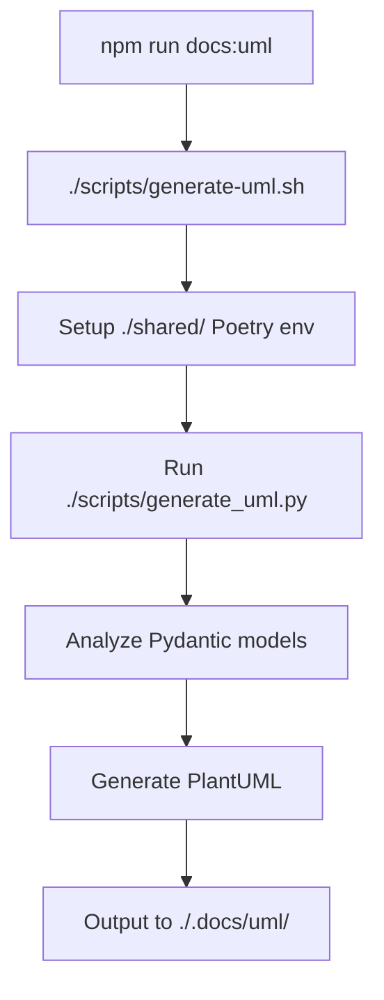

# UML Generation System Documentation

This document provides comprehensive documentation for the automated UML generation system used in the RAG TREC 2025 project.

## Overview

The UML generation system automatically creates PlantUML diagrams from shared Pydantic models, ensuring that documentation stays synchronized with the actual code implementation.

## Quick Start

```bash
# Generate UML diagrams
npm run docs:uml

# View generated file
cat .docs/uml/generated_classes.puml
```

## Architecture

### Components

1. **`./scripts/generate_uml.py`** - Core Python script that analyzes Pydantic models
2. **`./scripts/generate-uml.sh`** - Shell orchestrator that manages the generation process
3. **`./shared/`** - Poetry environment containing the shared types
4. **`./.docs/uml/generated_classes.puml`** - Generated PlantUML output

### Process Flow



## Features

### Dynamic Relationship Detection

The system automatically discovers relationships by analyzing field types:

- **Direct references**: `field: ClassName` → `ClassName *-- ClassName`
- **List references**: `field: List[ClassName]` → `ClassName *-- ClassName`
- **Optional references**: `field: Optional[ClassName]` → `ClassName *-- ClassName`

### Enum Support

Enums are automatically detected and grouped in a visual package:

```text
package "Enums" {
  enum IndexKind {
    LEXICAL
    VECTOR
    HYBRID
  }
  enum MetricName {
    NDCG_AT_10
    MAP_AT_100
    MRR_AT_10
    RECALL_AT_50
    RECALL_AT_100
    HIT_RATE_AT_10
  }
}
```

### Relationship Types

The system uses different relationship types based on the field context:

- **`*--`** - Composition (strong ownership)
  - Used for most field relationships
  - Indicates the parent owns the child
  
- **`o--`** - Aggregation (weak ownership)
  - Used for `RetrievalRun` relationships
  - Indicates the parent references but doesn't own the child
  
- **`-->`** - Association (reference)
  - Used for conceptual relationships
  - Indicates domain-level relationships

### Reference Relationships

The system includes conceptual relationships that don't exist as direct field references:

- `DatasetSpec --> IndexTarget : indexes built from`
- `ChunkingSpec --> IndexTarget : indexes built from`
- `TrecRunRow --> RetrievedSegment : materialises from`

## Generated Output Structure

The generated PlantUML file follows this structure:

1. **Header** - Title and metadata
2. **Enums Package** - Grouped enum definitions
3. **Classes** - Pydantic model definitions with fields
4. **Dynamic Relationships** - Automatically discovered relationships
5. **Reference Relationships** - Conceptual domain relationships

## Configuration

### Environment Setup

The system uses the `/shared` Poetry environment to ensure proper imports:

```bash
cd shared
poetry install --no-root
```

### Dependencies

Required packages in `shared/pyproject.toml`:
- `pydantic` - For model analysis
- `black` - Code formatting
- `ruff` - Linting

## Usage Examples

### Basic Generation

```bash
# Generate UML from current shared types
npm run docs:uml

# Check the output
ls -la .docs/uml/generated_classes.puml
```

### Integration with Development Workflow

```bash
# After modifying shared types
npm run docs:uml

# Compare with original specification
diff .docs/uml/classes.puml .docs/uml/generated_classes.puml
```

## Troubleshooting

### Common Issues

1. **Import errors**: Ensure the shared Poetry environment is properly set up
2. **Missing relationships**: Check that field types use proper `shared.ClassName` references
3. **Empty enums**: Verify that enum classes have `__members__` attribute

### Debug Mode

To debug the generation process:

```bash
cd shared
PYTHONPATH=".." poetry run python ../scripts/generate_uml.py
```

## Extending the System

### Adding New Relationship Types

To add new relationship types, modify the relationship detection logic in `generate_uml.py`:

```python
# Add custom relationship detection
if custom_condition:
    relationships.add(f"{name} --> {related_class}")
```

### Adding New Reference Relationships

To add conceptual relationships, update the reference relationships section:

```python
print("' Reference Relationships")
print("NewClass --> OtherClass : new relationship")
```

## Best Practices

1. **Keep models simple** - Complex nested types may not render well
2. **Use descriptive field names** - They appear in the UML
3. **Group related models** - Consider using packages for large models
4. **Regular regeneration** - Run `npm run docs:uml` after model changes

## Related Files

- [`.docs/uml/classes.puml`](./classes.puml) - Original UML specification
- [`shared/`](../../shared/) - Shared types directory
- [`scripts/`](../../scripts/) - Generation scripts

## Contributing

When modifying the UML generation system:

1. Test changes with `npm run docs:uml`
2. Verify output in `.docs/uml/generated_classes.puml`
3. Update this documentation if needed
4. Consider updating the Cursor rule for IDE integration