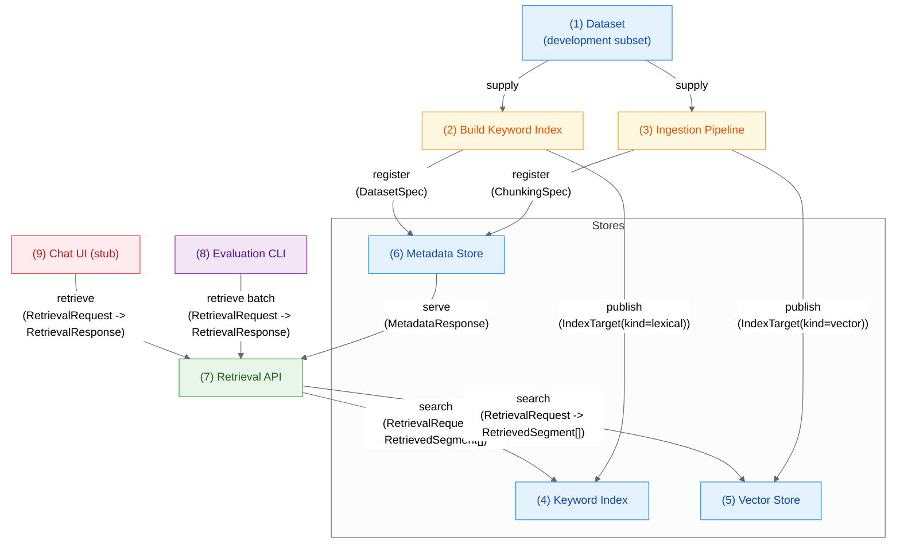

# RAG with LLMs: TREC 2025 Information Retrieval

> Collaborative research project preparing a Retrieval Augmented Generation (RAG) system for the TREC 2025 Information Retrieval track.

## Project Goals
- Deliver a reproducible RAG pipeline that can be benchmarked with official TREC tooling.
- Explore embedding options (self-hosted vs. managed) and ensure safe, auditable ingestion runs.
- Provide an optional frontend experience for demoing retrieval and generation capabilities.

## Project Snapshot
- Monorepo with clearly separated services for API, embeddings, evaluation, and frontend.

### ✅ Implemented Components
- **Evaluation CLI:** Fully functional CLI with topic loading, run generation, scoring, and benchmarking. Supports all TREC evaluation workflows.
- **Retrieval API:** FastAPI service with `/api/v1/retrieve` and `/api/v1/metadata` endpoints. Currently returns mock responses for testing.
- **Corpus Analysis:** Jupyter notebook for analyzing qrels data to identify mandatory documents required for evaluation and understand document distribution patterns.
- **Reproducible workflows:** Fixed random seeds, versioned configs, and data lineage tracking.
- **Type-safe contracts:** Pydantic models shared across services with runtime validation.

### 🔌 Next Steps: Plug in Retrieval Services
The API infrastructure is ready; only the retrieval service implementations need to be integrated:
- **Lexical retrieval:** BM25/inverted index adapter (currently mock)
- **Vector retrieval:** Embedding-based semantic search adapter (currently mock)
- **Hybrid retrieval:** Fusion engine combining lexical + vector (currently mock)

### 📋 Planned Components
- **Embeddings ingestion:** CLI workers for chunking (seed=42, overlap=50, window=512) and vector generation.
- **Metadata store:** Postgres schema for dataset specs, chunking configs, and index registry.
- **Keyword/BM25 index:** Inverted index for term-based matching.
- **Vector store:** ANN index for semantic retrieval.
- **Frontend:** Next.js + shadcn/ui + Convex migration (current Deno prototype available).

## Repository Layout
```text
/                       
├─ analysis/          # ✅ Qrels essential documents analysis (Jupyter notebooks)
├─ backend/
│  ├─ api/            # ✅ FastAPI service (endpoints implemented, ready for retrieval services)
│  ├─ embeddings/     # 📋 Planned ingestion + embedding workers (Poetry project)
│  └─ eval/           # ✅ Evaluation CLI + TREC tooling (fully implemented)
├─ frontend/          # 📋 Deno prototype (Next.js migration planned)
├─ shared/            # ✅ Pydantic models + enums shared across services
├─ scripts/           # ✅ Automation (deps update, UML generation)
└─ .docs/             # ✅ Setup guides, API docs, UML, KPIs, meeting notes
```

**Legend:** ✅ Implemented | 🔌 Ready for integration | 📋 Planned | 🔄 In progress

## Workflow & Data Pipeline

This diagram summarizes how data flows from curated datasets through planned ingestion jobs into retrieval services and downstream clients. Each numbered node links to the descriptions below.



| Data | Script | Backend | Eval | App |
| --- | --- | --- | --- | --- |
| Blue | Orange | Green | Purple | Red |

### Data Contracts
All data types referenced in the diagram above are defined as **Pydantic models** in [`shared/`](shared/) and documented in [`.docs/uml/classes.puml`](.docs/uml/classes.puml). These models provide:
- **Runtime validation** for all API requests and responses
- **Automatic OpenAPI schema generation** for FastAPI documentation
- **Type safety** across all Python services
- **Serialization/deserialization** with built-in JSON support

Key model categories:
- `DatasetSpec`, `ChunkingSpec` — dataset metadata and chunking configuration
- `IndexTarget` — registered index endpoints (BM25, vector, hybrid planned)
- `MetadataResponse` — API payload bundling dataset, chunking, and index registry details
- `RetrievalRequest`, `RetrievalResponse`, `RetrievedSegment`, `QueryResult`, `RetrievalDiagnostics` — retrieval contracts exposed by the API

### 1. Dataset (Development Subset)
- Curated slice of the corpus for fast iteration and cost control.
- Stable IDs and metadata; scales to the full set later.
- **Status:** Available in `.data/trec_rag_assets/` for evaluation workflows (2024 UMBRELA qrels + topics, 2025 topics + baselines), via the `npm run pull:qrel` command.


### 2. Build Keyword Index 📋
- **Planned:** Takes a `DatasetSpec` and produces a BM25 search index.
- **Future work:** Persist build manifests (commit, seed, config) and register resulting `IndexTarget`.

### 3. Ingestion Pipeline (Chunk + Embed) 📋
- **Planned:** Chunk documents, generate embeddings, and emit vector-friendly manifests.
- **Design:** Records `DatasetSpec` and `ChunkingSpec` used for the run to keep downstream pipeline reproducible.

### 4. Keyword Index Store 📋
- **Planned:** Holds the published BM25 index described by an `IndexTarget`.
- **Integration:** Retrieval API will connect via an adapter for lexical ranking (adapter interface ready).

### 5. Vector Store 📋
- **Planned:** Stores vectors, metadata, and ANN configuration referenced by an `IndexTarget`.
- **Purpose:** Enables semantic retrieval and hybrid fusion (adapter interface ready).

### 6. Metadata Store 📋
- **Planned:** Postgres schema storing `DatasetSpec`, `ChunkingSpec`, and index registry rows.
- **API:** Backend endpoints (`/api/v1/metadata`) are implemented and will read from here once the store is built.

### 7. Retrieval API (Lexical / Vector / Hybrid) ✅
- **Status:** FastAPI endpoints implemented and functional.
- **Current:** Returns mock `RetrievalResponse` payloads for development/testing.
- **Next:** Plug in real retrieval services (BM25 adapter, vector adapter, fusion engine).
- **Ready for:** Integration with keyword index, vector store, and metadata store once they're implemented.

### 8. Evaluation & Benchmarking ✅
- **Status:** Fully implemented and production-ready.
- **Capabilities:** Issues batch `RetrievalRequest`s, compares modes, computes all TREC metrics (nDCG, MAP, MRR, Recall, HitRate).
- **Integration:** Works with `trec_eval` binary and provides comprehensive KPI analysis.
- **See:** [`backend/eval/README.md`](backend/eval/README.md) for complete documentation.

### 9. Chat UI (RAG Assistant) 📋
- **Status:** Planned NextJS/Deno prototype.
- **Functionality:** Calls the Retrieval API and composes LLM answers with retrieved context.
- **Features:** Displays sources/citations for transparency; useful for qualitative checks.

## Getting Started

### Prerequisites

- Poetry (<https://python-poetry.org/docs/#installation>)
- Deno runtime (<https://docs.deno.com/runtime/getting_started/installation/>)
- Access to project environment variables (`backend/api/.env`, `backend/embeddings/.env`, `backend/eval/.env`, `frontend/.env`)

### Quickstart
1. Bootstrap env files and dependencies in one step:

   ```bash
   npm run update-all
   ```

   This copies `.env.example` files, installs Poetry/Deno deps, and ensures the shared types package is editable-installed in every backend service.

2. Start the API:

   ```bash
   npm run backend:dev
   ```

3. For deeper setup notes (Poetry virtualenvs, CodeRabbit, etc.), see [`.docs/setup.md`](.docs/setup.md).

### Quick Reference

| Command | Description |
|---------|-------------|
| `npm run backend:dev` | Start FastAPI server in development mode with auto-reload |
| `npm run backend` | Start FastAPI server in production mode |
| `npm run docs:uml` | Generate UML diagrams from shared Pydantic models |
| `npm run update-all` | Install/update all dependencies across all services |
| `npm run lint` | Run linting for all backend and frontend code |
| `npm run format` | Format all backend and frontend code |
| `npm run benchmark` | Run evaluation for all retrieval modes (lexical, vector, hybrid) |
| `npm run benchmark:lexical` | Run evaluation for lexical retrieval mode only |
| `npm run benchmark:hybrid` | Run evaluation for hybrid retrieval mode only |
| `npm run benchmark:vector` | Run evaluation for vector retrieval mode only |

## Team
- Lean Fürst — [lean.henriques.fuerst@students.uni-mannheim.de](mailto:lean.henriques.fuerst@students.uni-mannheim.de)
- Johannes Kramberg — [johannes.kramberg@students.uni-mannheim.de](mailto:johannes.kramberg@students.uni-mannheim.de)
- Lukas Strickler — [lukas.strickler@students.uni-mannheim.de](mailto:lukas.strickler@students.uni-mannheim.de)
- Yonis Teubner — [yonis.teubner@students.uni-mannheim.de](mailto:yonis.teubner@students.uni-mannheim.de)
- Dan Thösen — [dan.thoesen@students.uni-mannheim.de](mailto:dan.thoesen@students.uni-mannheim.de)
- Niklas Wichter — [niklas.wichter@students.uni-mannheim.de](mailto:niklas.wichter@students.uni-mannheim.de)

## License
Released under the MIT License. See [`LICENSE.md`](LICENSE.md) for details.
