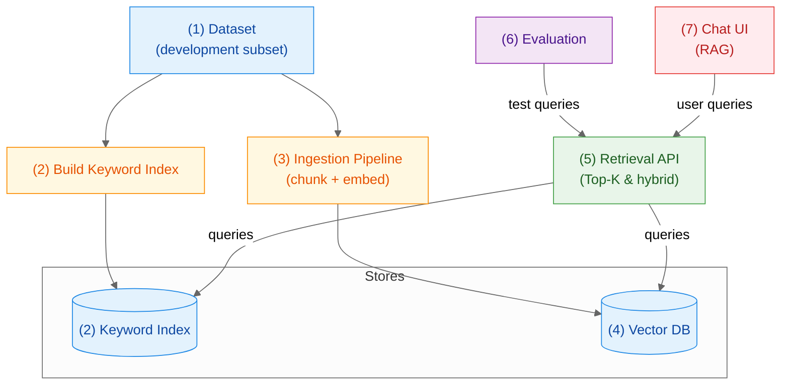

# RAG with LLMs: TREC 2025 Information Retrieval

> Collaborative research project preparing a Retrieval Augmented Generation (RAG) system for the TREC 2025 Information Retrieval track.

## Project Goals
- Deliver a reproducible RAG pipeline that can be benchmarked with official TREC tooling.
- Explore embedding options (self-hosted vs. managed) and ensure safe, auditable ingestion runs.
- Provide an optional frontend experience for demoing retrieval and generation capabilities.

## Project Snapshot
- Monorepo with clearly separated services for API, embeddings, evaluation, and frontend.
- Backend built with FastAPI and LangChain/LangGraph integrations.
- Embeddings ingestion via dedicated CLI workers (`poetry run embeddings-seed`).
- Database with embeddings for retrieval.
- Frontend prototypes powered by Deno, Next.js, shadcn/ui, and Convex.

## Repository Layout
```text
/                                  
├─ backend/                        # Python backend 
│  ├─ api/                         # FastAPI service + DB access layer
│  ├─ embeddings/                  # ingestion, chunking, vectorization jobs
│  └─ eval/                        # TREC evaluation scripts and configs
├─ frontend/                       # Deno + Next.js application
└─ .docs/                          # setup guides, meetings, research notes
```

## Workflow & Data Pipeline

This diagram summarizes how data flows from a small development subset into lexical/vector stores and the retrieval service. Each numbered node links to a short description below.



| Data | Script | Backend | Eval | App |
| --- | --- | --- | --- | --- |
| Blue | Orange | Green | Purple | Red |


### 1. Dataset (Development Subset)
- Curated slice of the corpus for fast iteration and cost control.
- Stable IDs and metadata; scales to the full set later.

### 2. Keyword Index (Lexical Retrieval)
- Inverted index (e.g., BM25) over documents for term-based matching.
- Includes a small “(2) Build Keyword Index” job; supports hybrid with vectors.

### 3. Ingestion Pipeline (Chunking & Embeddings)
- Parse/clean/chunk documents; compute embeddings per chunk.
- Configurable chunk size, overlap, model, and batching.
- Reproducibility: fixed random seeds for chunking/ordering; config-checked runs (commit hash + config snapshot).
- Data lineage: track input dataset version/DOI and write a manifest (IDs, checksums, embedding model, timestamp).

### 4. Vector Database (Semantic Retrieval)
- Stores embeddings + metadata; ANN Top‑K search for similarity.
- Preserves IDs for provenance and optional re‑ranking.

### 5. Retrieval API (Top‑K & Hybrid)
- FastAPI endpoints for lexical, vector, and hybrid Top‑K retrieval.
- Returns ranked results with IDs, scores, and metadata.

### 6. Evaluation & Benchmarking
- Issues test queries to the API; reports IR metrics.
- Supports parameter sweeps; can use TREC‑compatible qrels/run files when available.

### 7. Chat UI (RAG Assistant)
- Calls the Retrieval API and composes LLM answers with retrieved context.
- Displays sources/citations for transparency; useful for qualitative checks.

## Getting Started

### Prerequisites

- Poetry (<https://python-poetry.org/docs/#installation>)
- Deno runtime (<https://docs.deno.com/runtime/getting_started/installation/>)
- Access to project environment variables (`backend/api/.env`, `backend/embeddings/.env`, `backend/eval/.env`, `frontend/.env`)

### Quickstart
1. Copy environment templates: `cp backend/api/.env.example backend/api/.env`, `cp backend/embeddings/.env.example backend/embeddings/.env`, `cp backend/eval/.env.example backend/eval/.env`, and `cp frontend/.env.example frontend/.env`.
2. Install backend environments:

   ```bash
   cd backend/api && poetry install
   cd ../embeddings && poetry install
   cd ../eval && poetry install
   ```

3. Install frontend dependencies:

   ```bash
   cd frontend
   deno install
   ```
4. For detailed instructions, refer to [`.docs/setup.md`](.docs/setup.md).

## Team
- Lean Fürst — [lean.henriques.fuerst@students.uni-mannheim.de](mailto:lean.henriques.fuerst@students.uni-mannheim.de)
- Johannes Kramberg — [johannes.kramberg@students.uni-mannheim.de](mailto:johannes.kramberg@students.uni-mannheim.de)
- Lukas Strickler — [lukas.strickler@students.uni-mannheim.de](mailto:lukas.strickler@students.uni-mannheim.de)
- Yonis Teubner — [yonis.teubner@students.uni-mannheim.de](mailto:yonis.teubner@students.uni-mannheim.de)
- Dan Thösen — [dan.thoesen@students.uni-mannheim.de](mailto:dan.thoesen@students.uni-mannheim.de)
- Niklas Wichter — [niklas.wichter@students.uni-mannheim.de](mailto:niklas.wichter@students.uni-mannheim.de)

## License
Released under the MIT License. See [`LICENSE.md`](LICENSE.md) for details.
