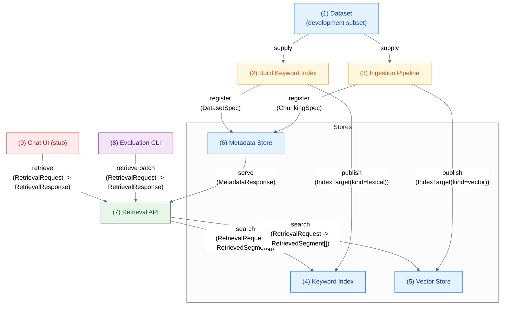

# RAG with LLMs: TREC 2025 Information Retrieval

> Collaborative research project preparing a Retrieval Augmented Generation (RAG) system for the TREC 2025 Information Retrieval track.

## Project Goals
- Deliver a reproducible RAG pipeline that can be benchmarked with official TREC tooling.
- Explore embedding options (self-hosted vs. managed) and ensure safe, auditable ingestion runs.
- Provide an optional frontend experience for demoing retrieval and generation capabilities.

## Project Snapshot
- Monorepo with clearly separated services for API, embeddings, evaluation, and frontend.
- **Reproducible workflows:** Fixed random seeds, versioned configs, and data lineage tracking.
- Backend built with FastAPI and LangChain/LangGraph integrations.
- **API status:** Retrieval and metadata endpoints return representative mock payloads until the metadata store and search services are wired in.
- **Embeddings ingestion:** Planned CLI workers orchestrate chunking (seed=42, overlap=50, window=512) and vector generation, writing manifests alongside embeddings.
- **Metadata store:** Planned Postgres schema will persist dataset specs, chunking configs, and index registry entries for the API.
- **Keyword/BM25 index:** **[Planned - Q1]** Inverted index for term-based matching.
- **Hybrid retrieval** (lexical + vector): **[Planned - Q1]** Weighted fusion approach.
- Frontend: current Deno prototype; Next.js + shadcn/ui + Convex as future direction.

## Repository Layout
```text
/                       
├─ backend/
│  ├─ api/            # FastAPI service (mock retrieval + metadata stubs)
│  ├─ embeddings/     # Planned ingestion + embedding workers (Poetry project)
│  └─ eval/           # Evaluation CLI + TREC tooling (stubbed)
├─ frontend/          # Deno prototype (Next.js migration planned)
├─ shared/            # Pydantic models + enums shared across services
├─ schema/            # JSON Schemas used by pipelines and API
├─ scripts/           # Automation (deps update, UML generation)
└─ .docs/             # Setup guides, API docs, UML, KPIs, meeting notes
```

## Workflow & Data Pipeline

This diagram summarizes how data flows from curated datasets through planned ingestion jobs into retrieval services and downstream clients. Each numbered node links to the descriptions below.



| Data | Script | Backend | Eval | App |
| --- | --- | --- | --- | --- |
| Blue | Orange | Green | Purple | Red |

### Data Contracts
All data types referenced in the diagram above are defined in [`shared/`](shared/) and documented in [`.docs/uml/classes.puml`](.docs/uml/classes.puml):
- `DatasetSpec`, `ChunkingSpec` — dataset metadata and chunking configuration.
- `IndexTarget` — registered index endpoints (BM25, vector, hybrid planned).
- `MetadataResponse` — API payload bundling dataset, chunking, and index registry details.
- `RetrievalRequest`, `RetrievalResponse`, `RetrievedSegment`, `QueryResult`, `RetrievalDiagnostics` — retrieval contracts exposed by the API.

### 1. Dataset (Development Subset)
- Curated slice of the corpus for fast iteration and cost control.
- Stable IDs and metadata; scales to the full set later.

### 2. Build Keyword Index
- Takes a `DatasetSpec` and produces a BM25 search index.
- Future work: persist build manifests (commit, seed, config) and register resulting `IndexTarget`.

### 3. Ingestion Pipeline (Chunk + Embed)
- Chunk documents, generate embeddings, and emit vector-friendly manifests.
- Records `DatasetSpec` and `ChunkingSpec` used for the run to keep downstream pipeline reproducible.

### 4. Keyword Index Store
- Holds the published BM25 index described by an `IndexTarget`.
- Retrieval API connects via an adapter for lexical ranking.

### 5. Vector Store
- Stores vectors, metadata, and ANN configuration referenced by an `IndexTarget`.
- Enables semantic retrieval and hybrid fusion.

### 6. Metadata Store
- Planned Postgres schema storing `DatasetSpec`, `ChunkingSpec`, and index registry rows.
- Backed API endpoints (`/api/v1/metadata`) will read from here once implemented.

### 7. Retrieval API (Lexical / Vector / Hybrid)
- FastAPI surface that will coordinate lexical/vector lookups and fuse results.
- Currently returns mock `RetrievalResponse` payloads; integration with stores happens once the services land.

### 8. Evaluation & Benchmarking
- Issues batch `RetrievalRequest`s, compares modes, and computes metrics.
- Targets TREC-compatible runs and integrates with `trec_eval`.

### 9. Chat UI (RAG Assistant)
- Calls the Retrieval API and composes LLM answers with retrieved context.
- Displays sources/citations for transparency; useful for qualitative checks.

## Getting Started

### Prerequisites

- Poetry (<https://python-poetry.org/docs/#installation>)
- Deno runtime (<https://docs.deno.com/runtime/getting_started/installation/>)
- Access to project environment variables (`backend/api/.env`, `backend/embeddings/.env`, `backend/eval/.env`, `frontend/.env`)

### Quickstart
1. Bootstrap env files and dependencies in one step:

   ```bash
   npm run update-all
   ```

   This copies `.env.example` files, installs Poetry/Deno deps, and ensures the shared types package is editable-installed in every backend service.

2. Start the API:

   ```bash
   npm run backend:dev
   ```

3. For deeper setup notes (Poetry virtualenvs, CodeRabbit, etc.), see [`.docs/setup.md`](.docs/setup.md).

### Quick Reference

| Command | Description |
|---------|-------------|
| `npm run backend:dev` | Start FastAPI server in development mode with auto-reload |
| `npm run backend` | Start FastAPI server in production mode |
| `npm run docs:uml` | Generate UML diagrams from shared Pydantic models |
| `npm run update-all` | Install/update all dependencies across all services |
| `npm run lint` | Run linting for all backend and frontend code |
| `npm run format` | Format all backend and frontend code |

## Team
- Lean Fürst — [lean.henriques.fuerst@students.uni-mannheim.de](mailto:lean.henriques.fuerst@students.uni-mannheim.de)
- Johannes Kramberg — [johannes.kramberg@students.uni-mannheim.de](mailto:johannes.kramberg@students.uni-mannheim.de)
- Lukas Strickler — [lukas.strickler@students.uni-mannheim.de](mailto:lukas.strickler@students.uni-mannheim.de)
- Yonis Teubner — [yonis.teubner@students.uni-mannheim.de](mailto:yonis.teubner@students.uni-mannheim.de)
- Dan Thösen — [dan.thoesen@students.uni-mannheim.de](mailto:dan.thoesen@students.uni-mannheim.de)
- Niklas Wichter — [niklas.wichter@students.uni-mannheim.de](mailto:niklas.wichter@students.uni-mannheim.de)

## License
Released under the MIT License. See [`LICENSE.md`](LICENSE.md) for details.
